# Borcum Ne? #

## A Software Service To Manage Depts in Your Market or Pharmacy ##

### 1.Sign In Page. ###
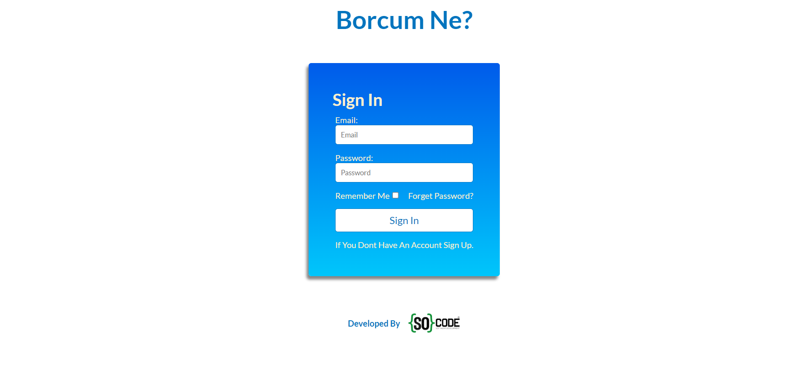

### 2. Depts Page Where You See All Customer's Depts And Add A New Dept. ###
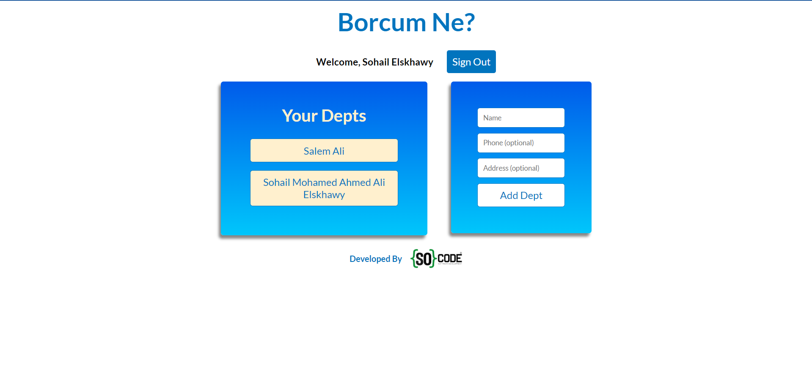

### 3. When You Select A Customer's Dept You Can See His Dept Info, The Items or Products He took as Dept. ###
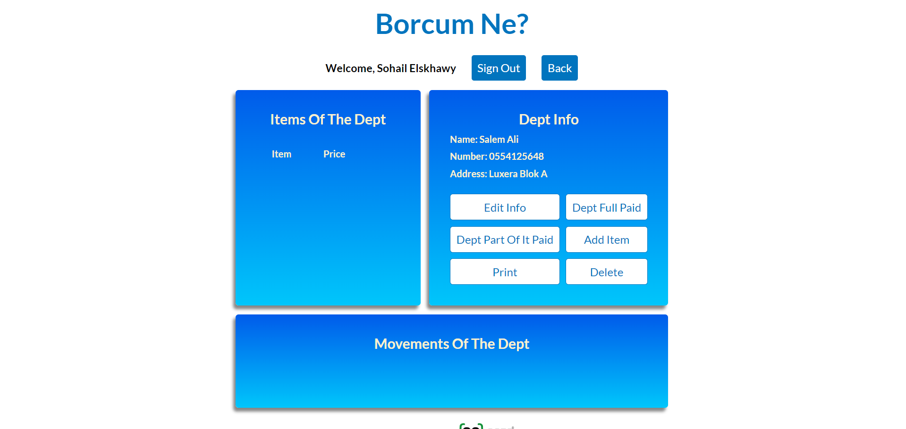

### 4. There's A lot of Functions You Can Do. ###
### a. Add An Item. ###
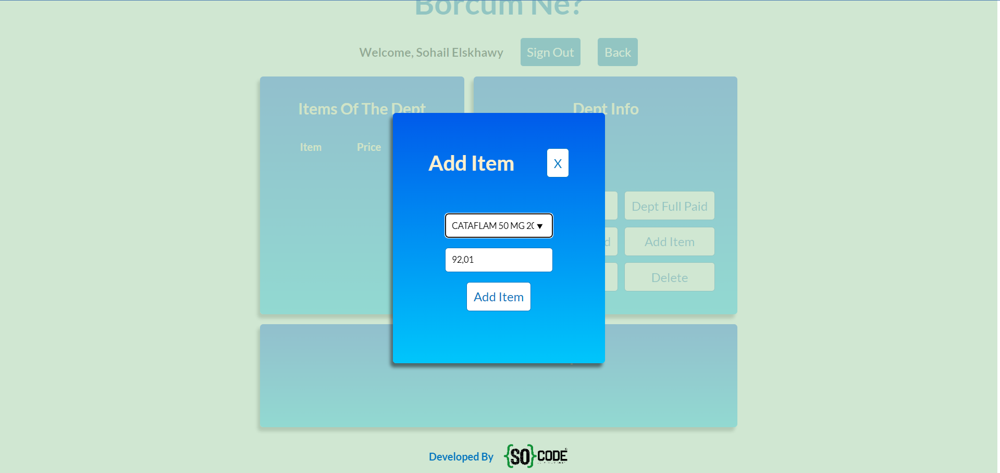

#### There is A Datalist of Live Data of Real Drugs With There Prices Coming From an API ####
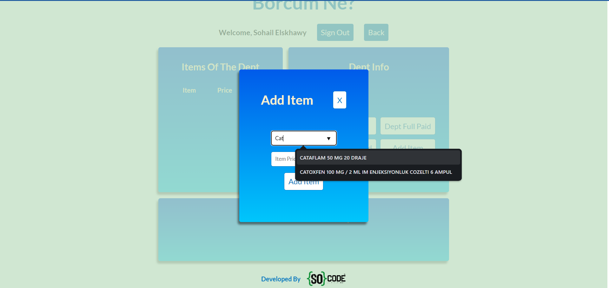

#### Item is Added And A Log is Recorded For That ####
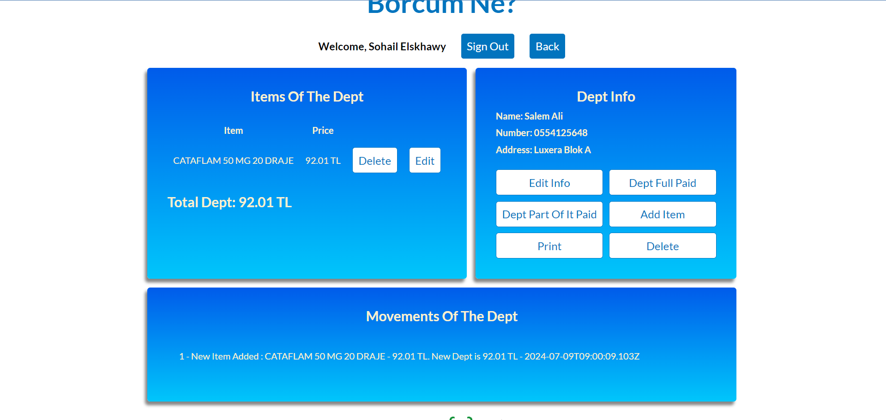

### b. Pay The Dept Fully or Partially. ###

#### Paying Partially ####
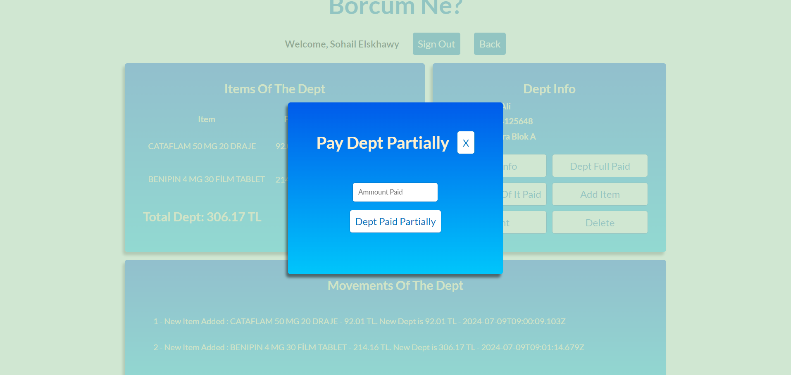
.png)
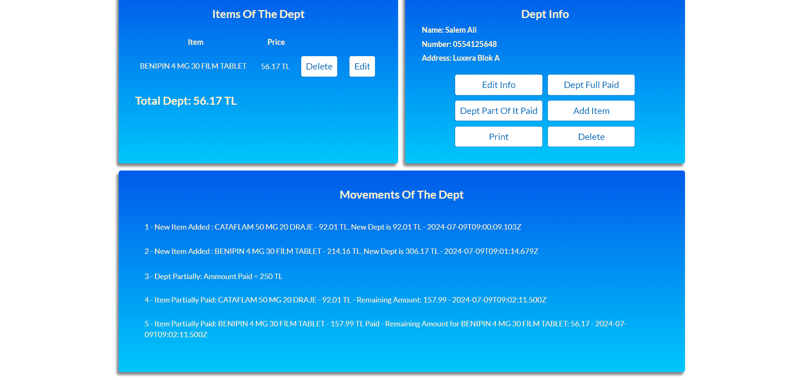

#### Paying The Full Dept ####
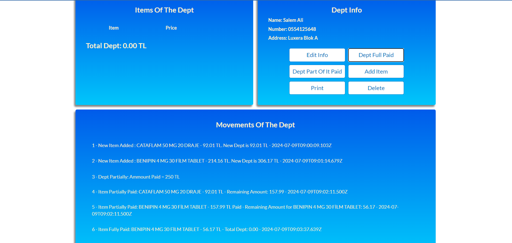

### c. Print The Dept To Show The Customer. ###
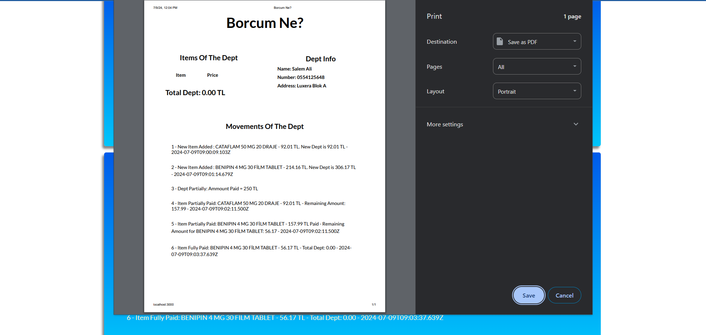

### d. You Can Edit Info of the Customer In Case of A Mistake Written. ###
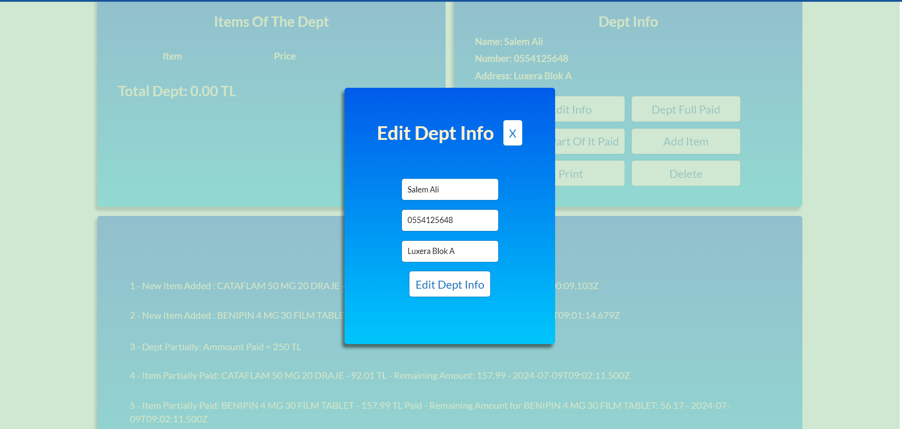

### e. Delete The Dept Of The Customer ###
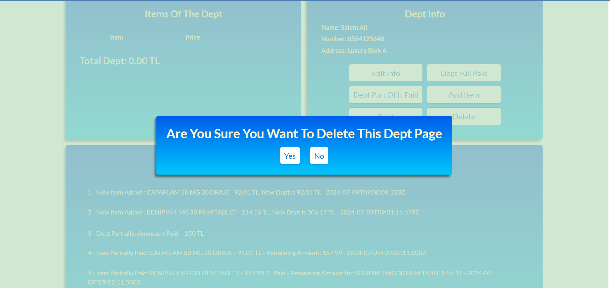

### Depts Page ###
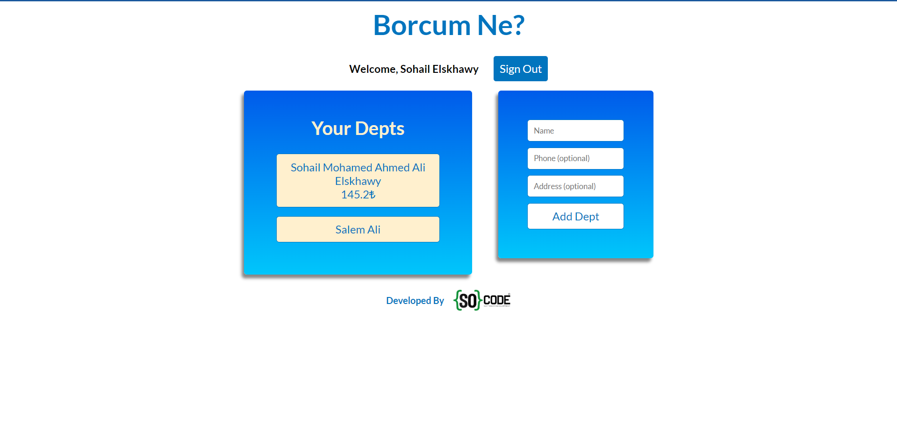
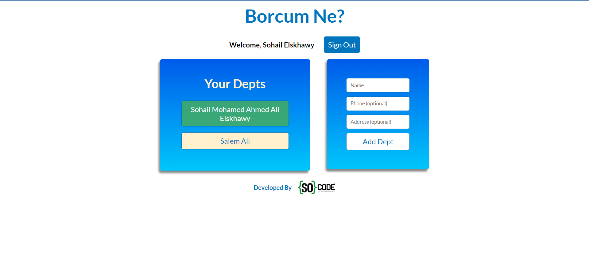

